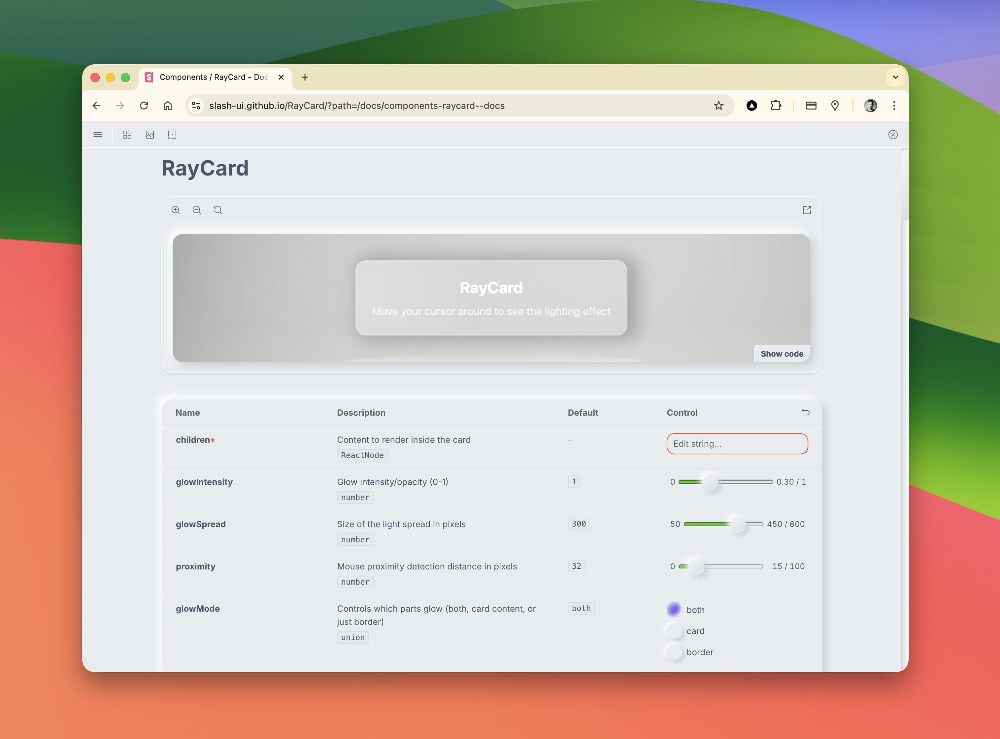

<p align="center">
  
</p>

<h1 align="center">RayCard</h1>

<p align="center">
  <strong>Interactive glassmorphism card component with cursor-reactive lighting effects</strong>
</p>

<p align="center">
  <a href="https://www.npmjs.com/package/@slash-ui/ray-card"></a>
  <a href="https://github.com/Slash-ui/RayCard/blob/main/LICENSE"></a>
  <a href="https://github.com/Slash-ui/RayCard/actions/workflows/deploy-storybook.yml"></a>
  <a href="https://slash-ui.github.io/RayCard/"></a>
  
  
</p>

<p align="center">
  <a href="https://slash-ui.github.io/RayCard/">Live Demo</a> •
  <a href="#features">Features</a> •
  <a href="#installation">Installation</a> •
  <a href="#usage">Usage</a> •
  <a href="#props">Props</a>
</p>

<p align="center">
  
</p>

---

## Features

- **Glassmorphism design** — Beautiful frosted glass effect with blur
- **Cursor tracking** — Dynamic lighting that follows your mouse
- **Proximity detection** — Glow activates as cursor approaches the card
- **Multiple glow modes** — Card glow, border glow, or both
- **React 19 ready** — Built with modern patterns (ref-as-prop, optimized state)
- **Security hardened** — Input validation prevents CSS injection attacks
- **Fully accessible** — ARIA attributes and keyboard navigation support
- **Zero runtime dependencies** — Pure React, no external libraries

---

## Live Demo

Explore the component in our interactive Storybook:

**[https://slash-ui.github.io/RayCard/](https://slash-ui.github.io/RayCard/)**

<p align="center">
  
</p>

---

## Installation

```bash
# npm
npm install @slash-ui/ray-card

# yarn
yarn add @slash-ui/ray-card

# pnpm
pnpm add @slash-ui/ray-card
```

---

## Usage

```tsx
import { RayCard } from "@slash-ui/ray-card";

function App() {
  return (
    <RayCard
      glowColor="rgba(99, 102, 241, 0.8)"
      glowMode="border"
      glowSpread={400}
    >
      <h2>Hello World</h2>
      <p>Move your cursor to see the lighting effect!</p>
    </RayCard>
  );
}
```

### Border-Only Glow

```tsx
<RayCard glowMode="border" glowColor="rgba(255, 255, 255, 0.9)">
  <p>Subtle border glow effect</p>
</RayCard>
```

### High Intensity

```tsx
<RayCard glowIntensity={1} glowSpread={500} glowColor="cyan">
  <p>Maximum glow effect</p>
</RayCard>
```

---

## Props

<p align="center">
  
</p>

| Prop            | Type                           | Default                   | Description                        |
| --------------- | ------------------------------ | ------------------------- | ---------------------------------- |
| `children`      | `ReactNode`                    | —                         | Content to render inside the card  |
| `className`     | `string`                       | —                         | Additional CSS classes             |
| `glowColor`     | `string`                       | `"rgba(255,255,255,0.8)"` | Color of the glow effect           |
| `glowIntensity` | `number`                       | `1`                       | Glow opacity (0-1)                 |
| `glowSpread`    | `number`                       | `300`                     | Size of light spread in pixels     |
| `borderRadius`  | `string`                       | `"16px"`                  | Border radius of the card          |
| `proximity`     | `number`                       | `32`                      | Mouse detection distance in pixels |
| `disabled`      | `boolean`                      | `false`                   | Disable the lighting effect        |
| `glowMode`      | `"both" \| "card" \| "border"` | `"both"`                  | Control which parts glow           |
| `ref`           | `Ref<HTMLDivElement>`          | —                         | Ref to the root element            |
| `aria-label`    | `string`                       | —                         | Accessible label for the card      |

---

## Development

### Prerequisites

- Node.js 20+
- Yarn

### Getting Started

```bash
# Clone the repository
git clone https://github.com/Slash-ui/RayCard.git
cd RayCard

# Install dependencies
yarn install

# Start Storybook dev server
yarn storybook
```

### Available Scripts

| Script                 | Description                                         |
| ---------------------- | --------------------------------------------------- |
| `yarn storybook`       | Start Storybook dev server at http://localhost:6006 |
| `yarn build-storybook` | Build static Storybook for deployment               |
| `yarn test`            | Run tests in watch mode                             |
| `yarn test:run`        | Run tests once                                      |
| `yarn typecheck`       | Run TypeScript type checking                        |

### Project Structure

```
RayCard/
├── .github/workflows/     # GitHub Actions (auto-deploy to Pages)
├── .storybook/            # Storybook configuration & theme
├── src/
│   ├── assets/            # Images, logos, GIFs
│   ├── components/
│   │   ├── ray-card.tsx           # Main component
│   │   ├── ray-card.stories.tsx   # Storybook stories
│   │   ├── ferdowsi-page.tsx      # Example page
│   │   └── ferdowsi-page.stories.tsx
│   ├── css/               # Global styles, themes
│   └── utils/
│       ├── validation.ts          # Security validation
│       └── validation.test.ts     # 38 unit tests
├── package.json
└── vitest.config.ts
```

---

## Security

RayCard validates all user-controlled props to prevent CSS injection attacks:

- **Color validation** — Hex, RGB, RGBA, HSL, HSLA, and named CSS colors
- **Border radius validation** — Safe CSS length values only
- **Numeric clamping** — Values constrained to safe ranges

Invalid inputs automatically fall back to secure defaults.

---

## Browser Support

| Browser | Version |
| ------- | ------- |
| Chrome  | Latest  |
| Firefox | Latest  |
| Safari  | Latest  |
| Edge    | Latest  |

---

## About Slash UI

<p align="center">
  <strong>"You bring the idea, we bring the code"</strong>
</p>

[Slash UI](https://www.slashui.com) is a Singapore-based venture building studio that transforms startup concepts into production-ready MVPs. Founded by Amin Shariati with 20+ years of engineering experience, Slash UI partners with founders to build fast, reliable products ready to grow from day one.

**What we do:**

- Full-stack MVP development
- Technical co-founder services
- AI and machine learning integration
- Cloud architecture and deployment

Visit [slashui.com](https://www.slashui.com) to learn more.

---

## License

MIT © [Slash UI Pte. Ltd.](https://www.slashui.com)

---

## Contributing

Contributions are welcome! Please feel free to submit a Pull Request.

1. Fork the repository
2. Create your feature branch (`git checkout -b feature/amazing-feature`)
3. Commit your changes (`git commit -m 'feat: add amazing feature'`)
4. Push to the branch (`git push origin feature/amazing-feature`)
5. Open a Pull Request
